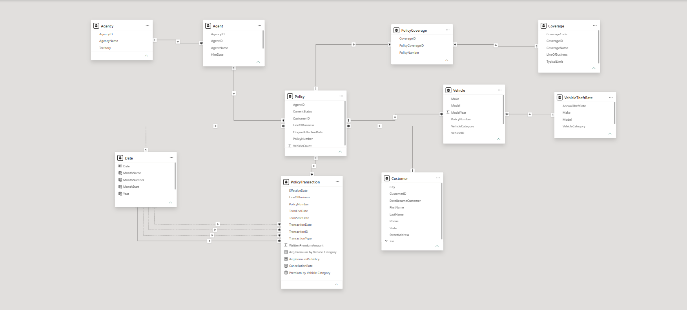
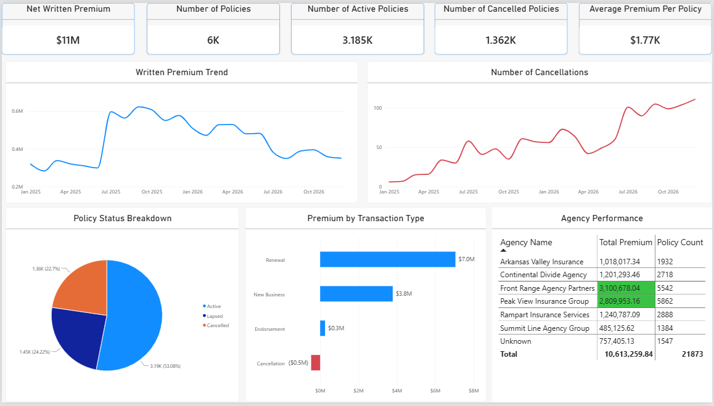
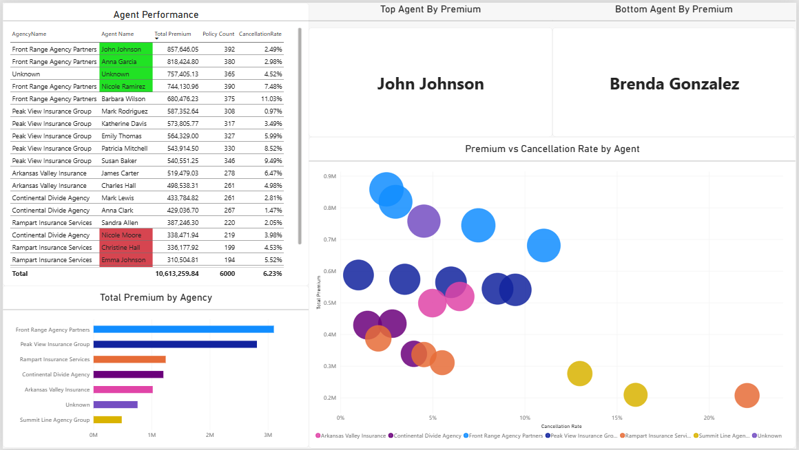
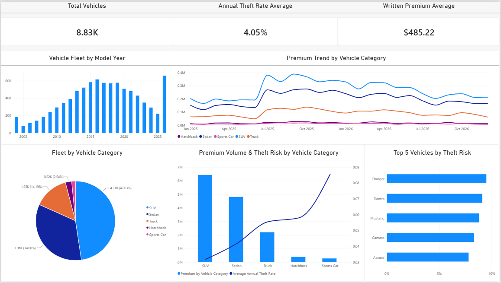

# Front Range Mutual — Personal Auto BI Dashboard

A Power BI portfolio project built around a fictional personal auto insurance carrier, Front Range Mutual Insurance. The goal isn't just to make some charts look nice. It's to work through the kind of modeling and data-quality problems that show up in relational data generally: composite keys, fan-out relationships, dirty source data. I picked an insurance dataset because it gave me a reason to build a real star schema, not because these problems are unique to insurance.

## Why synthetic data

All of the underlying data (customers, policies, agents, vehicles, etc.) is generated, not real. I built it that way on purpose so I could bake in realistic problems to solve rather than working with a dataset that's already clean. A few examples:

- Vehicle theft rates are grounded in actual NICB theft statistics (Hyundai Elantra, Dodge Charger, and Honda Accord all show up near the top of the list, same as they do in real-world reporting)
- `TransactionDate` has a mix of date formats across the file, which will quietly break your visuals if you don't catch it
- About 70 customer records are near-duplicates. Same name and address, entered twice, which happens in real systems any time the same person gets re-entered instead of matched to an existing record
- The Policy → Vehicle relationship is genuinely many-to-many (a policy can cover more than one vehicle), which causes a fan-out problem once you try to slice premium by vehicle attributes. This isn't insurance-specific. It's the same issue you'd hit with orders and line items, or visits and diagnoses, any time a fact table sits downstream of a many-to-many join

## Data model

Star schema, `PolicyTransaction` as the fact table:

```
PolicyTransaction (fact)
  └── Policy (hub)
        ├── Customer
        ├── Agent → Agency
        └── Vehicle → VehicleTheftRisk
  └── PolicyCoverage (bridge) → Coverage
```

`VehicleTheftRisk` relates to `Vehicle` on a composite Make+Model key, since Power BI doesn't support multi-column relationships natively. Handled with a merged key column built in Power Query on both sides.



## Pages

**Overview.** KPI cards, premium trends, cancellation trends, policy status breakdown, and an agency performance table with conditional formatting.



**Agent / Agency Performance.** Cancellation rate by agent, top/bottom performers, and a premium-vs-cancellation-rate scatter plot by agent.



**Vehicle Risk Analysis.** Fleet composition, model year distribution, the highest theft-risk models, and premium trends by vehicle category.



## Data quality issues found & fixed

This is the part I actually learned the most from, so it's worth calling out specifically rather than burying it:

- **Fan-out on Policy → Vehicle.** Slicing `PolicyTransaction` by `VehicleCategory` gave every category the same flat total, because a transaction on a multi-vehicle policy has no way to resolve to just one vehicle through a straightforward relationship. Fixed with a `TREATAS` measure that explicitly filters `PolicyTransaction` by the set of policies tied to a given vehicle category, rather than relying on the relationship to do it automatically.
- **Mixed date formats.** `TransactionDate` mixes `YYYY-MM-DD` and `MM/DD/YYYY` strings. A naive column-type conversion silently drops or misreads a chunk of rows. Worth checking for anytime a date field is coming from a messy source.
- **Composite key relationship.** `VehicleTheftRisk` keys on Make+Model, not a single ID, so I built a concatenated key column in Power Query (`Make & "|" & Model`) on both tables to relate them.
- **Near-duplicate customers.** About 70 customer records are the same person entered twice under slightly different circumstances. Worked through the actual dedup logic in Power Query (group by name and address, check which record has a policy attached, drop the one that doesn't) instead of patching the source file directly. The interesting part was learning that matching on name alone throws a lot of false positives, since common names collide, while name and address together narrows it down to real duplicates.
- **Auto date/time hierarchy.** Started out relying on Power BI's automatic date hierarchy, which turned out to be fragile (an accidental drill-up reset a chart's whole axis). Replaced it with an actual Date table, marked as the official date table and related to `PolicyTransaction`.

## Tech

- Power BI Desktop (Power Query / M, DAX)
- Python (pandas, numpy) for generating and adjusting the source data

## Status

In progress. A Customer-focused page is next.
